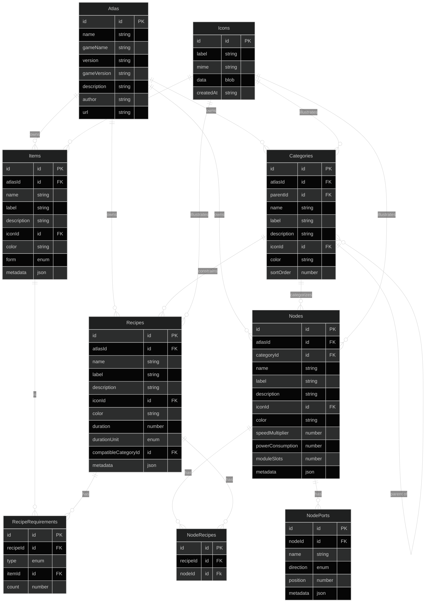

# Pulling compute out of the client

Goal: less business logic and state living in the browser, more of it behind
RESTful calls to the backend. This is worth doing now because (a) accounts are
on the table, which means data needs a real home instead of `localStorage`,
and (b) the backend is slated for a Rust rewrite eventually, so anything we
build server-side now should be boring and portable (plain REST + SQLite, no
framework magic) rather than something that has to be re-derived later.

## Already server-side — the pattern to repeat

- **`/api/atlas/parse`, `/parse-file`, `/serialize`** (`server/src/parser/`) —
  the DSL <-> Atlas JSON conversion has always lived server-side, driven by
  the Langium grammar. Good precedent: parsing/generation is exactly the kind
  of thing that shouldn't be duplicated in the browser.
- **`/api/icons`** (`server/src/icons/`, added this session) — icon storage
  moved from client `localStorage` (raw base64 blobs embedded per-item) to a
  SQLite-backed store, content-addressed by hash, served over plain REST
  (`GET/POST /api/icons`, `GET /api/icons/:id`). The client now just holds a
  URL string. This is the template for the next few moves: identify a chunk
  of client state, give it a real ID/URL, let the server own the bytes.

## Good candidates to move next

These are all *pure functions of explicit inputs* today — no hidden client
state, no interactivity requirement — which makes them cheap to lift into an
endpoint whenever the data they operate on (the atlas, the graph) actually
lives server-side.

1. **Atlas mutations** — `client/src/features/atlas-editor/atlas-mutations.ts`
   (`addItem`/`updateItem`/`addRecipe`/`updateRecipe`/`addNodeTemplate`/
   `updateNodeTemplate`/`addCategory`, plus the `slugifyId` helper). Right
   now the client builds the entire new `Atlas` array in memory and re-saves
   the whole blob to `localStorage` on every edit. Once atlases are
   account-scoped resources instead of one JSON blob, this logic — validate
   the input, assign an id, persist — is exactly what the backend should own.
   Natural shape: `POST /api/atlas/:id/items`, `PATCH /api/atlas/:id/items/:itemId`,
   etc., instead of "download the whole atlas, mutate it, re-upload it."

2. **Production-rate calculations** — `client/src/utils/node-utils.ts`
   (`getRates`, `getAllFloatingRates`) and `client/src/features/stats/useStats.ts`.
   Currently recomputed client-side in a `useMemo` on every graph/atlas
   change. It's already explicitly partial (the code comments admit it only
   accounts for *floating* — unconnected — ports, not full graph balancing).
   A real solver that propagates rates through connected edges is real CPU
   work and should not run in the browser, especially as graphs grow. Good
   candidate for `POST /api/graph/stats` once graphs live server-side.

3. **Atlas indexing** — `client/src/features/atlas-editor/atlas-index.ts`
   (`buildAtlasIndex`). Rebuilds lookup maps (`itemsById`, `recipesByNodeType`,
   etc.) from the raw atlas arrays on every load. If the atlas moves
   server-side, this either becomes a one-time server-side computation the
   API serves pre-indexed, or the API is shaped so the client never needs the
   full index at all (e.g. paginated/queried lookups instead of "give me
   everything and I'll build maps locally").

## What should stay client-side, and why

Not everything belongs on the server — these need to answer within the same
frame as user input, so round-tripping to a server would make the app feel
broken:

- **`reducers/graph-reducer.ts` + `state/graph-actions-slice.ts`** — undo/redo
  history, node drag positions, stacking/unstacking nodes. This is
  interactive, per-drag state. If graph persistence moves server-side later,
  sync on meaningful checkpoints (save/blur), not on every position update.
- **`utils/graph-utils.ts` edge validity** (`areItemsCompatible`,
  `findInvalidEdges`) — evaluated live while the user is dragging a new edge
  on the canvas; needs an instant answer.
- **The DSL text editor's debounced parse** (`features/atlas-editor/`) — this
  is actually already the right model: keystrokes stay local, but validation
  already round-trips to `/api/atlas/parse` on a debounce. Worth keeping as
  the reference pattern for "client stays responsive, server stays
  authoritative."

## The big one: persistence itself

`client/src/utils/persistence.ts` is 100% `localStorage` — the atlas, the
graph, UI settings, and the DSL editor text all live only in the browser.
This is the actual blocker for cross-device use and for accounts, and it's
the highest-leverage change here — but also the biggest lift: real storage
(SQLite is already proven out via the icon store), an auth story, and a
migration path for whatever's already sitting in existing users'
`localStorage`.

Suggested sequencing, roughly easiest/most-isolated first:

1. Icons — done.
2. Atlas storage (items/recipes/nodes/categories) — the actual content,
   highest value, but touches the most call sites (`atlas-mutations.ts`, all
   three `Add*Form` components, the DSL round-trip).
3. Graph storage — needs more care since it's the live interactive editing
   surface; sync-on-checkpoint rather than sync-on-every-change.
4. UI settings — lowest priority; arguably fine to stay local-only forever.

